<!-- Slide number: 1 -->

# THE INVISIBLE APPLICANT: ILLUMINATING THE JOURNEY FROM DATA DESERT TO Credit Worthiness

## HOME CREDIT DEFAULT RISK PREDICTION

Kaushik Radhakrishnan Musuwathi (A0327229B)
Venkatesh Basavaraj Honnakasturi (A0329909M)
Norbert Oliver (A0328685M)
Samarth Soni (A0329960U)
Sandesh Sreepathy Upadhyaya (A0327834X)

<!-- Slide number: 2 -->

# ABOUT SOVEREIGN PRISM

## [the idea] A global financial services company focused on making lending simple and accessible for everyone

Lending to people banks ignore
Home Credit specifically serves customers with little or no credit history - people who are typically turned away by traditional banks. The goal is to give everyone a fair chance to access financing.

Simple, fast and accessible loans
Products are designed to be easy to understand and quick to access - both online and in-store. Customers can apply and get approved without complicated paperwork or long waiting times.

Responsible lending at the core
Home Credit does not just give out loans - it lends responsibly. This means carefully assessing each customer's ability to repay so they are not put into financial difficulty. That is exactly where a risk scoring system like this one plays a critical role.

A global business with local reach
With a plan to operate across 4 SEA countries, we will partner with banks, credit agencies, and regulators to open up the borrowers pool. Our longer vision is to make credit available wherever customers already shop - enabling e-commerce platforms and retailers to offer financing at the point of purchase.

<!-- Slide number: 3 -->

# STAKEHOLDERS
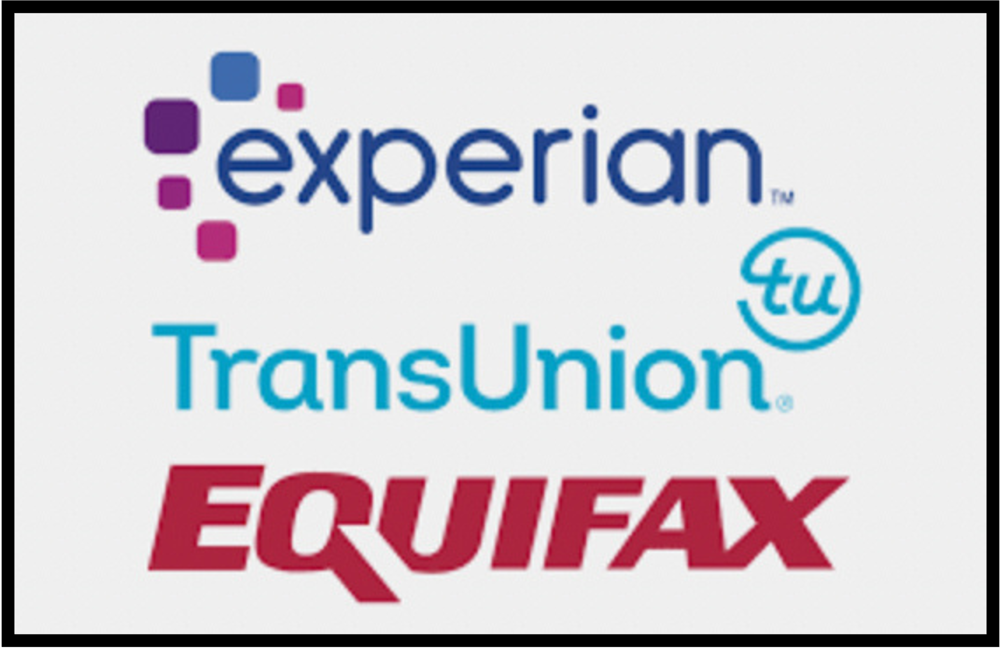

## Banking & Financial Partners
Profitability | Customer Trust | Data privacy

Help them make smarter investments with marginal CAC, directly improving LTV:CAC ratio

Give them control over what we can see / use from their data pool

## Credit Bureau Companies

ROI | Integration Complexity | Strategic fit

Help them provide better credit scores to more people

Generate more fee-based recurring revenue

## Regulators & Governments
Risk Exposure | Data Governance | Model Fairness

Privacy-by-default architecture: All data usage is consent-based and model predictions auditable

Compliance and Regulatory-aware ; Bias-aware

<!-- Slide number: 4 -->

# BUSINESS PROBLEM

Home Credit serves unbanked and underbanked populations with limited credit history.

Challenge: Predict loan default using alternative behavioral data instead of traditional files.

Business Goal: Expand financial inclusion while maintaining robust credit risk management.

<!-- Slide number: 5 -->

# BUSINESS OBJECTIVES
S - Build and evaluate Logistic Regression, Random Forest, XGBoost and LightGBM on 205 features from all 8 tables

M - Achieve AUC > 0.75 on test data and quantify the uplift from adding supplementary behavioral data to application-only models

A - Engineer features from 8 interlinked tables covering 307,511 applicants with 3 modeling pipelines (Application-Only, Combined, PCA)

R - Provide an interpretable credit scoring framework (A/B/C scores) that supports real-world lending decisions and reduces default risk

T - Complete all EDA, feature engineering, modeling, and reporting within the project timeframe

# TECHNICAL OBJECTIVES
## Collect and Process Data

Download 8 datasets from Kaggle via Google Drive, clean and preprocess to handle missing values, anomalies, and encoding

## Perform Exploratory Data Analysis (EDA)
Analyze target imbalance, feature distributions, correlations, and missing patterns across application and supplementary tables
## Feature Engineering
Aggregate 7 supplementary tables into borrower-level features and merge with application data to create 205 combined features

## Build Predictive Models
Train and compare LR, RF, XGBoost, and LightGBM across three pipelines: Application-Only, Combined, and PCA-reduced

## Evaluate Model Performance
Compare AUC-ROC across pipelines, analyze feature importance (SHAP), and validate with cross-validation

## Develop Credit Scorecard
Build logistic regression scorecard and A/B/C scoring framework for interpretable risk segmentation

<!-- Slide number: 6 -->

# DATA ACQUISITION & CLEANING
Home Credit Risk Data
(www.home-credit-default-risk.com)
-> Kaggle dataset download via Google Drive
-> Review column types and nature of values present
Delete columns with high proportion of missing values

-> Perform imputation
Median based = Numerical
Mode based = Categorical
Column type conversion for better analytics
-> Create columns through data transformation for necessary attributes

<!-- Slide number: 7 -->

# DATA QUALITY ANALYSIS
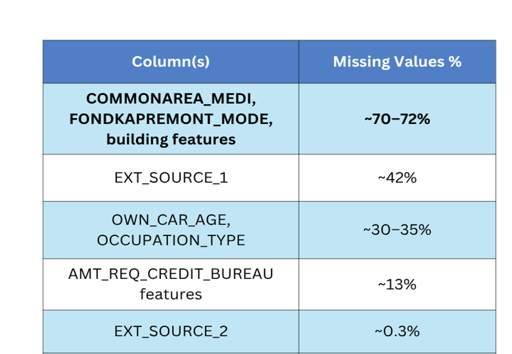
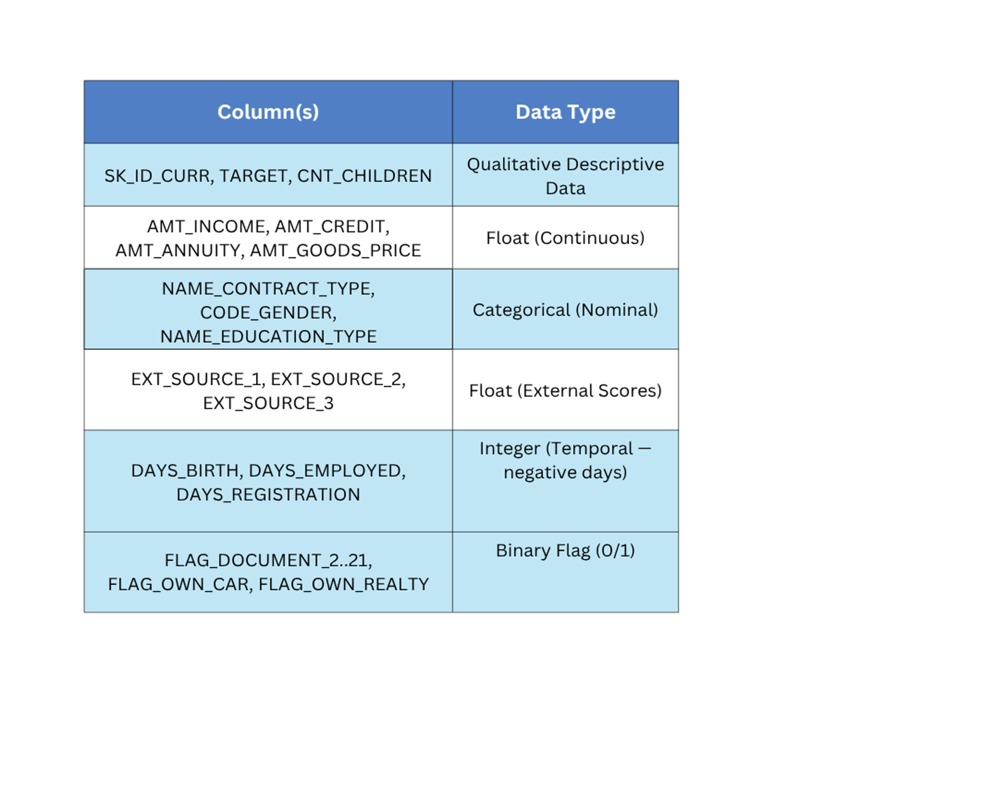

62 columns contain missing values. Building-related features (70% missing) were dropped. EXT_SOURCE_1 (40% missing) was imputed using median. The DAYS_EMPLOYED anomaly (365,243 value in 18% of records) was flagged and replaced with NaN. Outlier treatment was performed via winsorization for highly skewed financial features.

<!-- Slide number: 8 -->

# Data Dictionary
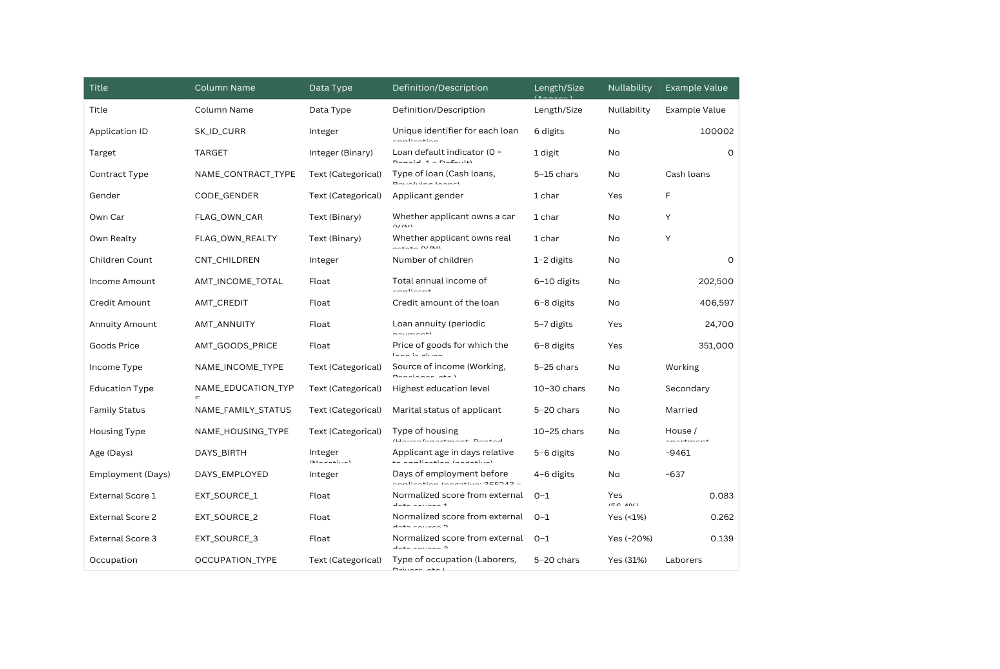

# Physical Data Model
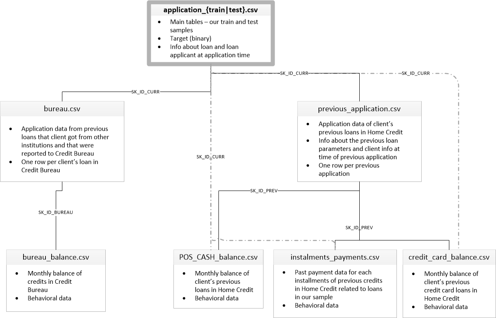

application_train.csv: 307,511 rows × 122 columns. 16 categorical features, 106 numeric features. Target variable has 8.04% default rate (1:11.4 class imbalance).

Tables are linked through internal id for individuals, internal id for individual’s previous applications, and bureau’s id for individuals.

<!-- Slide number: 9 -->

# QUICK SUMMARY STATS
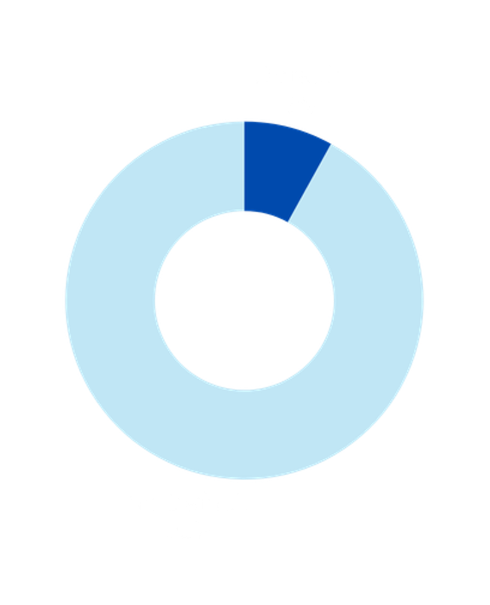
Our dataset has a severe imbalance of the 'Default' class (1:11.4 ratio). To combat this,we consider recall/precision and AUC-ROC to be relevant metrics for model performance.

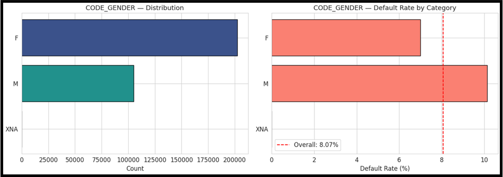

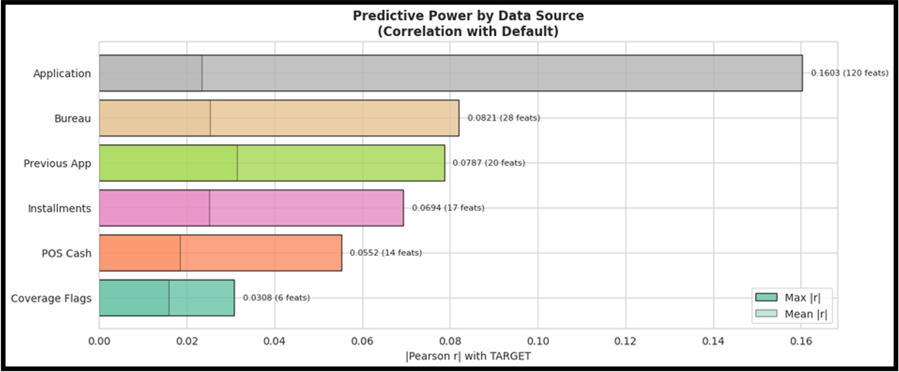

## Key Data Sources
Application Data
Bureau Records
Previous Applications
POS Cash Balance
Credit Card Balance
Installments Payments
Bureau Balance

## Key Performance Indicators:

We majorly focus on RECALL (for Loss Prevention and Safe Bets) ;
AUC helps us to increase model “goodness” by balancing FPs and FNs

## Other Important Metrics:

Highest Default Segment: Males aged 20-25 (~11% default rate)

Total Supplementary Records: 55M+ (across 7 tables)

<!-- Slide number: 10 -->

# MODEL ARCHITECTURE
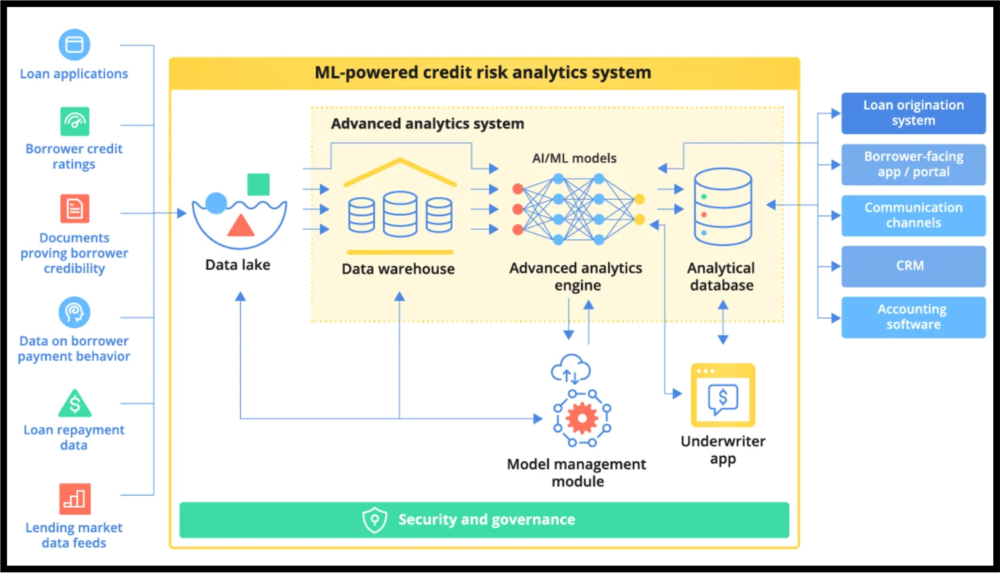

<!-- Slide number: 11 -->

# KEY FEATURE DISTRIBUTIONS
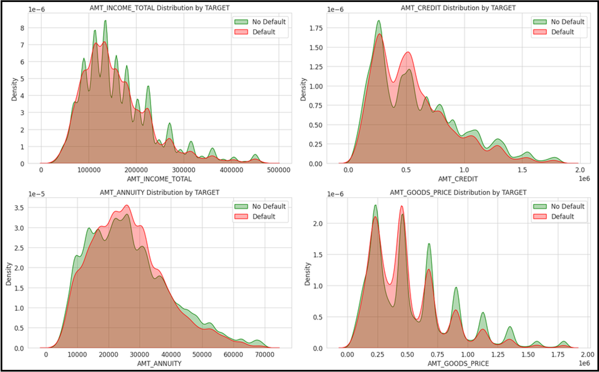
Financial features (income, credit, annuity) show subtle but consistent shifts — defaulters have lower medians with wider outlier ranges. Non-linear combinations are needed for robust separation.

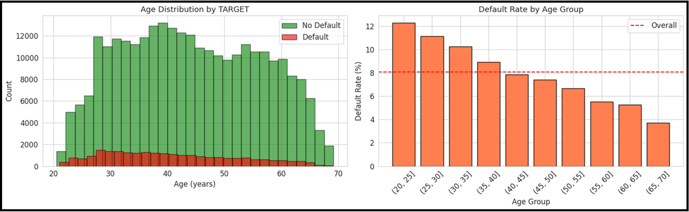
EXT_SOURCE scores show the clearest class separation — defaulters cluster at low values (0.0–0.3). These 3 features alone account for ~40% of model signal.
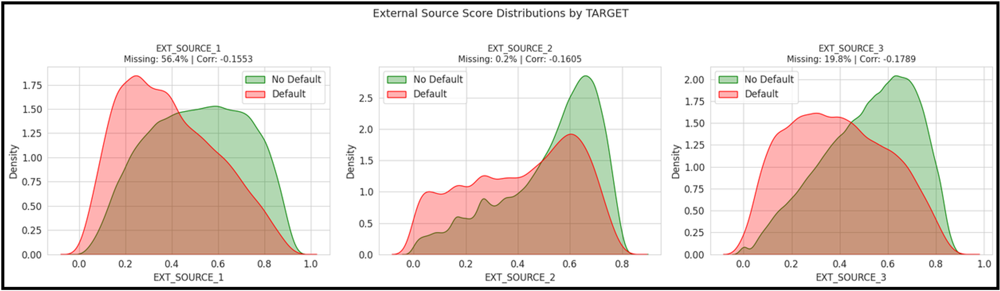

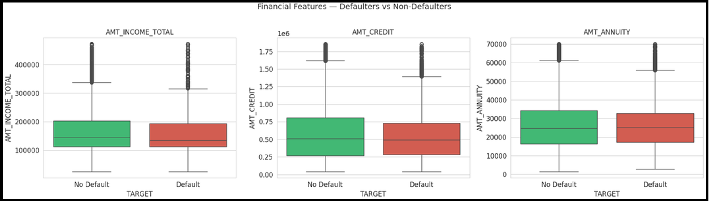
Feature distributions reveal that single-variable separation is weak for most financial features (significant class overlap), justifying the use of tree-based ensemble models (LightGBM, XGBoost) that capture complex non-linear interactions across 200+ features.

<!-- Slide number: 12 -->

# EXTERNAL DATA ANALYSIS

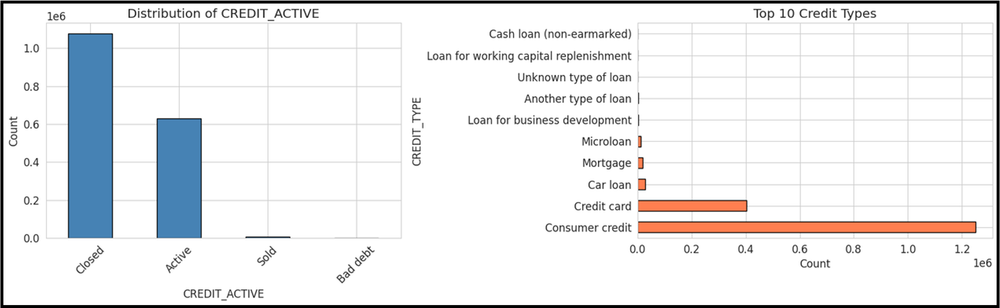
Covers 85.7% of applicants. Most credits are "Closed" or "Active" with low delinquency. Mean 8 credits per applicant (max 300+). DPD > 0 in only a small fraction — generally well-managed external credit histories. Consumer loans are the most common credit type.

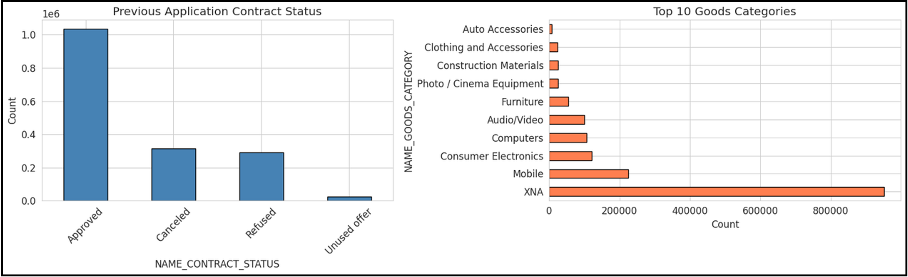
Covers 94.6% of applicants. ~87% of previous applications were approved. Top goods categories: Consumer goods, Mobile phones, Electronics. Mean 5–6 prior applications per client. Prior application behavior provides orthogonal predictive signal beyond current application data.

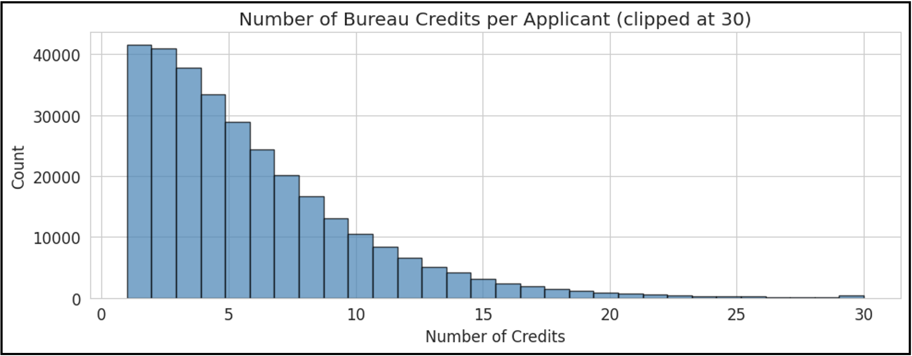
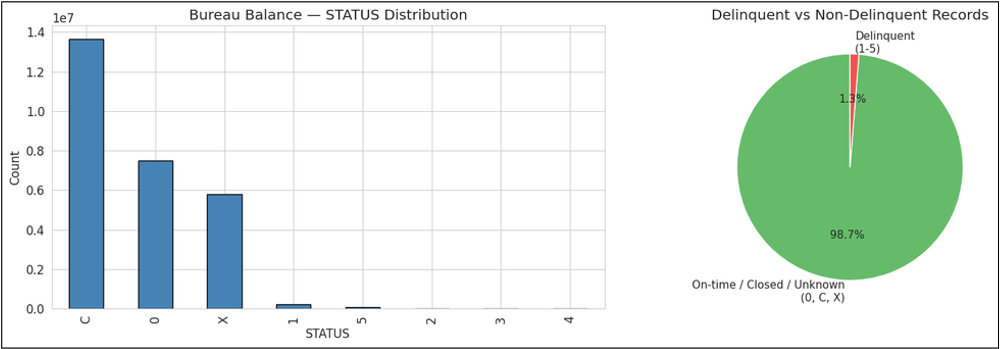
Bureau Balance (27.3M records) is the largest supplementary table. Status 0 (on-time) accounts for ~85% of all records; delinquent statuses (1–5) represent <1%. ~95% of monthly statuses are non-delinquent, indicating strong overall credit health in the portfolio.

<!-- Slide number: 13 -->

# INTERNAL BEHAVIOURAL DATA
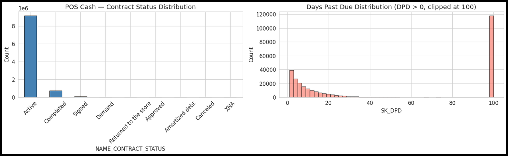
POS Cash Balance (10M records)
Tracks monthly installment payments on point-of-sale loans, covering 94.1% of applicants. Almost all payments are on time, with overdue cases in just 0.3% of records.

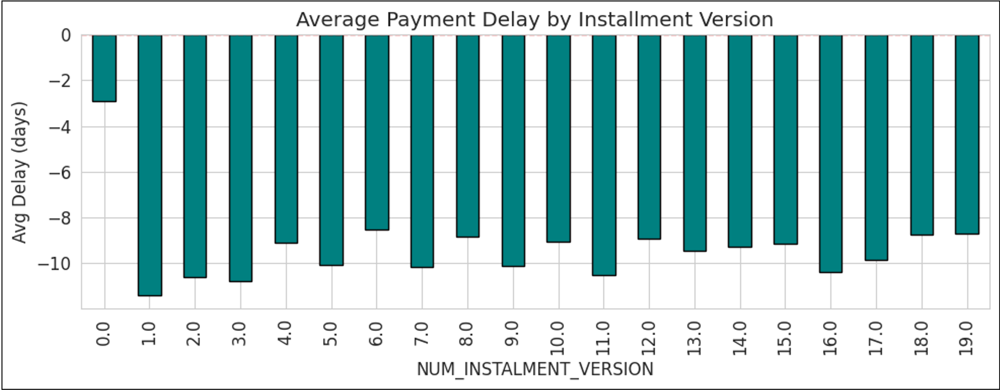

These three tables capture how borrowers actually repay existing loans. After aggregation, they produce 85 features that, combined with application data, boost prediction accuracy by 3.1%

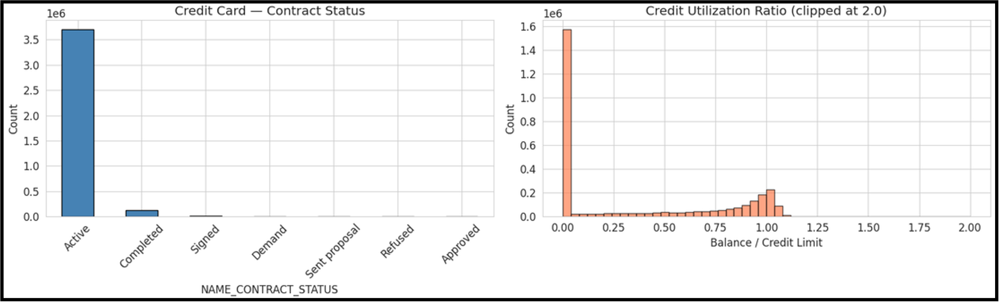

Credit Card Balance (3.84M records)
Captures monthly credit card usage and repayment, but only for 28.3% of applicants. Card utilization is moderate (30–50%), and overdue cases are rare at 0.2%.

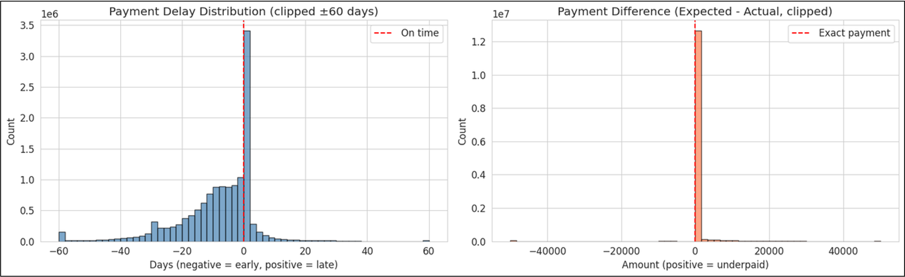

Installments Payments (13.6M records)
Records each individual loan repayment, covering 94.8% of applicants. About 5–10% of payments are late, with an average delay of 5–10 days.

<!-- Slide number: 14 -->

# CORRELATION MATRIX
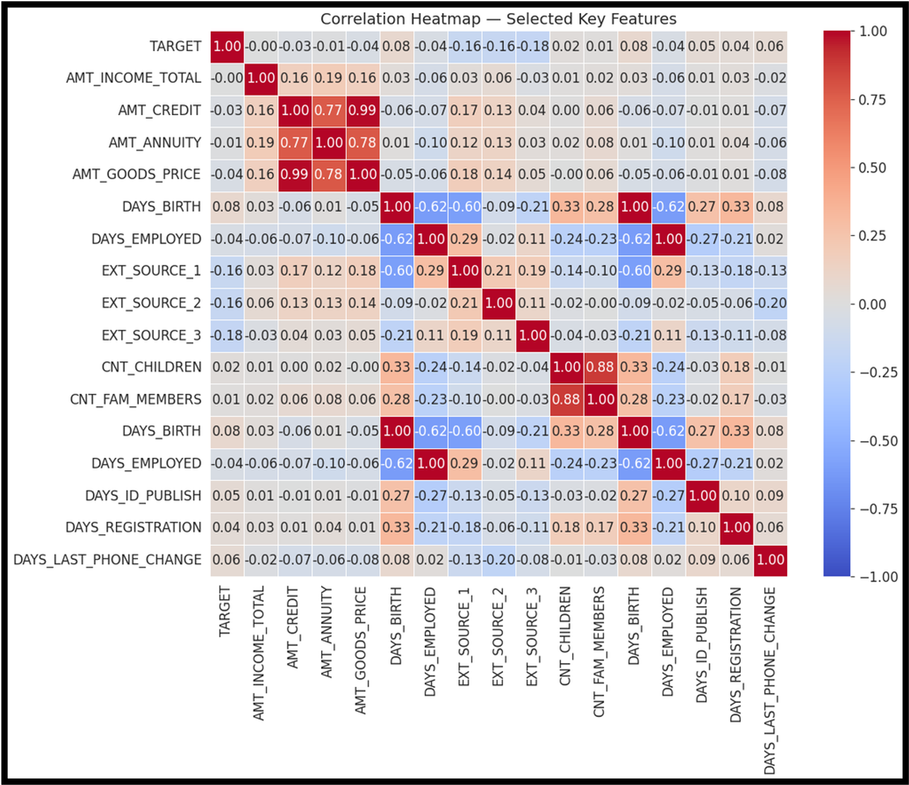

This correlation matrix shows how applicant features relate to loan default (TARGET).
## Features with highest correlation to default
 Strongest (negative) predictors:
EXT_SOURCE_2 (r=−0.16)

EXT_SOURCE_3 (r=−0.18)

EXT_SOURCE_1 (r=−0.16)
These external credit scores are the strongest single predictors of repayment — higher scores mean lower default risk.

Older people slightly less risky (note: DAYS_BIRTH is negative in dataset, so interpretation depends on sign convention)

DAYS_BIRTH (r=+0.08)

## Features with weaker correlation:

AMT_CREDIT (r=−0.03)

AMT_INCOME_TOTAL (~0)
Financial amounts have very weak correlation

<!-- Slide number: 15 -->
# Feature Engineering Pipeline

## BUREAU & BUREAU BALANCE
• Aggregated credit counts and active loan ratios.
• Mean Days Past Due (DPD) and total credit amounts.
• Historical debt exposure across external institutions.

## PREVIOUS APPLICATIONS
• Approval/Rejection rates and contract types.
• Requested vs. actual credit amounts.
• Decision latency and application frequency.

## POS CASH & CREDIT CARD
• Monthly DPD frequency and installment counts.
• Credit card utilization ratios and balance trends.
• Behavioral spending and repayment patterns.

## INSTALLMENT PAYMENTS
• Late payment ratios and average delay days.
• Payment vs. installment amount discrepancies.
• Consistency of repayment behavior over time.

<!-- Slide number: 16 -->
# Why Two Data Strategies? Traditional vs Alternative Data

## Traditional Data (Application-Only)
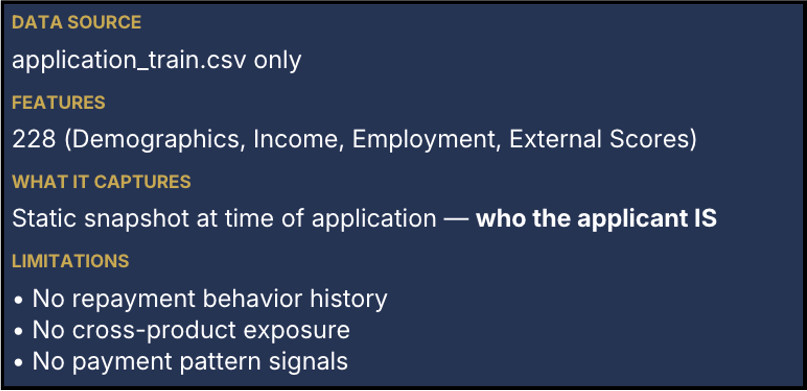

## Traditional + Alternative Data (Combined)
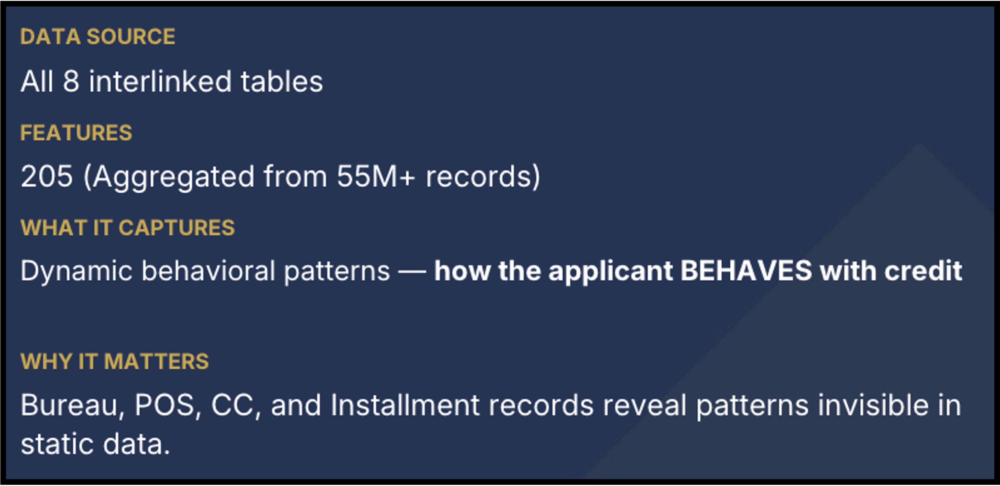

"The key question: Does adding alternative data add meaningful improvement for default prediction over traditional application data alone?"

<!-- Slide number: 17 -->

# WOE/IV FEATURE SELECTION (SCORECARD)
Combined Pipeline — All 8 tables aggregated
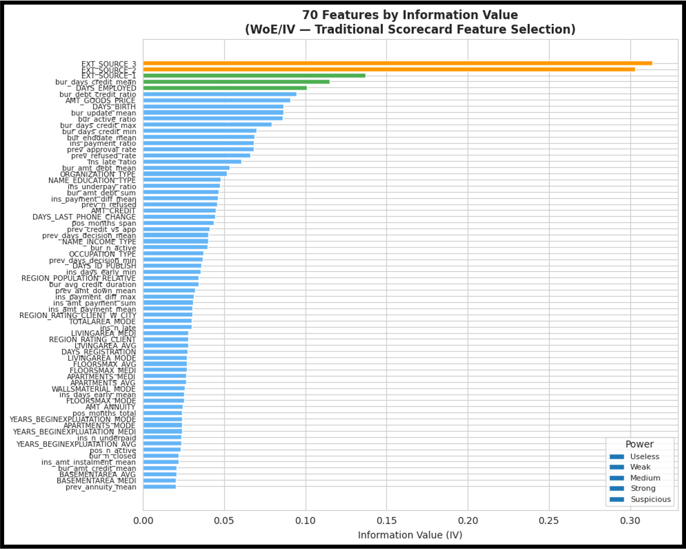

## IV INTERPRETATION SCALE

| IV Range | Predictive Power | Distribution |
| --- | --- | --- |
| < 0.02 | Useless | 93 |
| 0.02 to 0.1 | Weak | 65 |
| 0.1 to 0.3 | Medium | 3 |
| 0.3 to 0.5 | Strong | 2 |

Selection Result: ~70 features meet the IV > 0.02 threshold, ensuring a balance between predictive signal and model parsimony.

<!-- Slide number: 18 -->

# PREDICTIVE MODELLING

## TRAINING SET: 80%
## VALIDATION SET: 20%

<!-- Slide number: 19 -->

# Model Selection

## Logistic Regression
Used for interpretable credit scoring and baseline comparison, enabling transparent decision-making and regulatory compliance.

## Random Forest
Used to capture non-linear relationships and feature interactions while providing a robust baseline with reduced overfitting.

# XGBoost
Used for high predictive performance by modeling complex patterns and handling imbalanced credit risk data effectively.

# LightGBM
Used for scalable and efficient learning on large, high-dimensional datasets, achieving the best overall performance.

<!-- Slide number: 20 -->

# TRADITIONAL DATASET ANALYSIS
*
1-> Default
0-> Not-Default

| Model | Accuracy | Recall | AUC | Misclassified Defaults |
| --- | --- | --- | --- | --- |
| Logistic Regression | No PCA = 0.69 PCA = 0.69 | No PCA = 0.68 PCA = 0.68 | No PCA = 0.75 PCA = 0.75 | No PCA = 1592 PCA = 1592 |
| Random Forest | No PCA = 0.67 PCA = 0.70 | No PCA = 0.67 PCA = 0.61 | No PCA = 0.73 PCA = 0.72 | No PCA = 1686 PCA = 1951 |
| XGBoost | No PCA = 0.71 PCA = 0.70 | No PCA = 0.68 PCA = 0.65 | No PCA = 0.76 PCA = 0.74 | No PCA = 1599 PCA = 1768 |
| LightGBM | No PCA = 0.70 PCA = 0.70 | No PCA = 0.69 PCA = 0.66 | No PCA = 0.76 PCA = 0.74 | No PCA = 1571 PCA = 1726 |
LightGBM excels as the top model with 69% on recall, and 76% area for AUC, misclassifying only 1,571 defaults.
XGBoost matched LightGBM in some metrics since they are the most similar to one another, but lagged in recall and default detection.
Essentially: These structured, widely available datasets form the quantitative backbone of portfolio analytics.

<!-- Slide number: 21 -->
*
# COMBINED DATASET ANALYSIS
Undersampled = No PCA + Undersampling Majority Class

| Model | Accuracy | Recall | AUC | Misclassified Defaults |
| --- | --- | --- | --- | --- |
| Logistic Regression | No PCA = 0.69 PCA = 0.66 Undersampled = 0.7 | No PCA = 0.69 PCA = 0.6 Undersampled = 0.7 | No PCA = 0.76 PCA = 0.68 Undersampled = 0.76 | No PCA = 1117 PCA = 1498 Undersampled = 1135 |
| Random Forest | No PCA = 0.84 PCA = 0.84 Undersampled = 0.79 | No PCA = 0.42 PCA = 0.27 Undersampled = 0.56 | No PCA = 0.76 PCA = 0.68 Undersampled = 0.76 | No PCA = 2119 PCA = 2726 Undersampled = 1661 |
| XGBoost | No PCA = 0.86 PCA = 0.83 Undersampled = 0.74 | No PCA = 0.38 PCA = 0.26 Undersampled = 0.65 | No PCA = 0.76 PCA = 0.66 Undersampled = 0.77 | No PCA = 2309 PCA = 2746 Undersampled = 1300 |
| LightGBM | No PCA = 0.81 PCA = 0.83 Undersampled = 0.8 | No PCA = 0.51 PCA = 0.3 Undersampled = 0.56 | No PCA = 0.77 PCA = 0.68 Undersampled = 0.78 | No PCA = 1775 PCA = 2602 Undersampled = 1639 |
Undersampling gives better recall (misclassified defaults) performance, especially for the tree-based models which are more prone to overfitting due to a higher number of extra features.
When using alternative data alongside traditional data, Logistic Regression performs better in terms of recall.
We can also see that good recall performance means sacrificing overall accuracy.
Essentially: These non-traditional signals differentiate the model and unlock insights unavailable to incumbents.

<!-- Slide number: 22 -->

# SHAP Explainability
## Logistic Regression
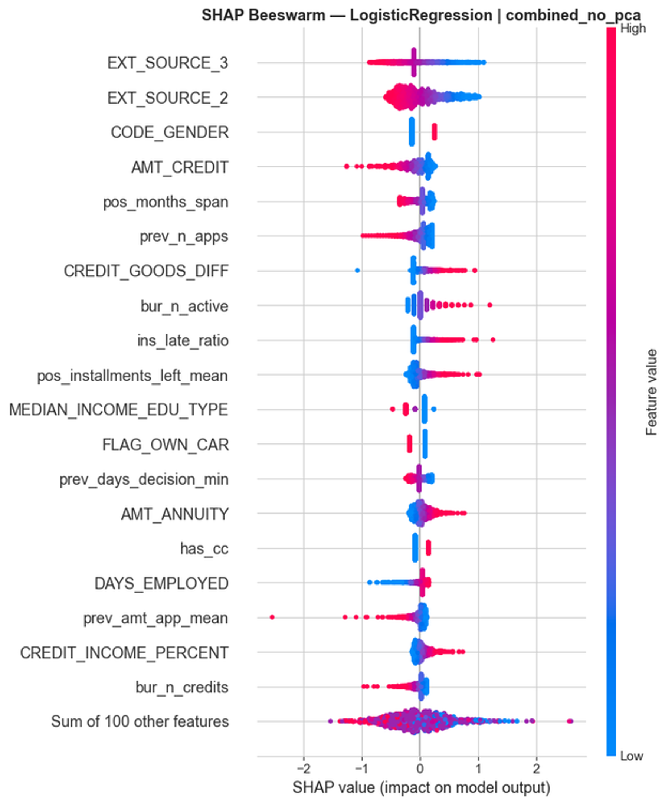
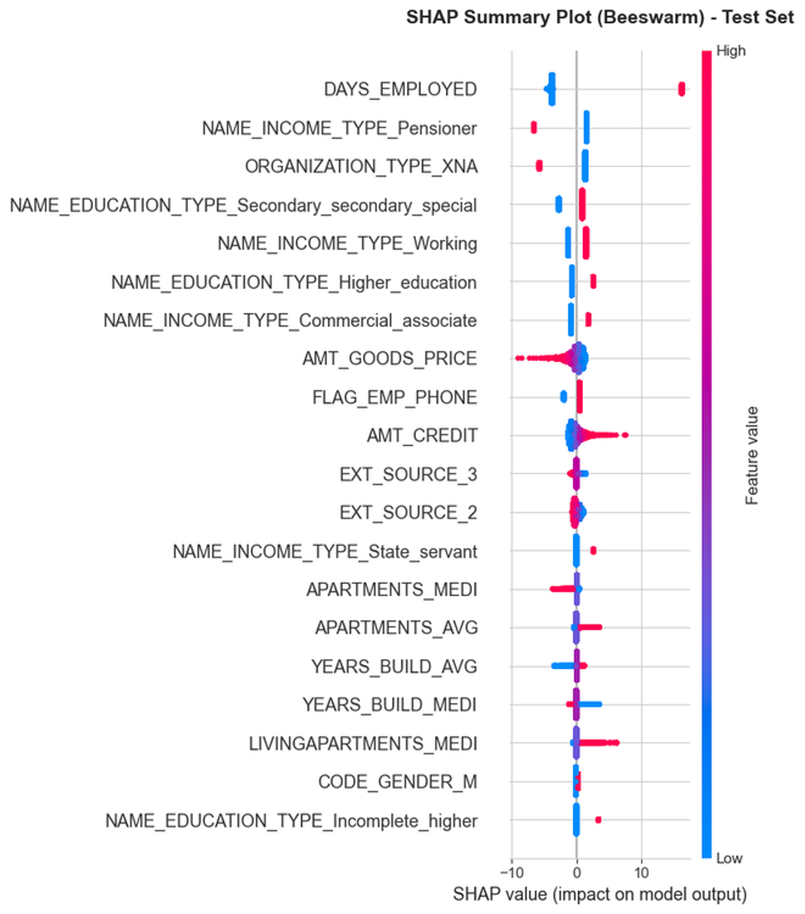

### TRADITIONAL

A few features especially DAYS_EMPLOYED, income type, AMT_CREDIT, and EXT_SOURCE variables explain most of the variation in predicted default risk.

### COMBINED DATASET

As we train it on a set with higher dimensions, Logistic Regression turns to external sources, where higher external scores indicate the individual is less likely to default.

<!-- Slide number: 23 -->

# SHAP Explainability

## Random Forest
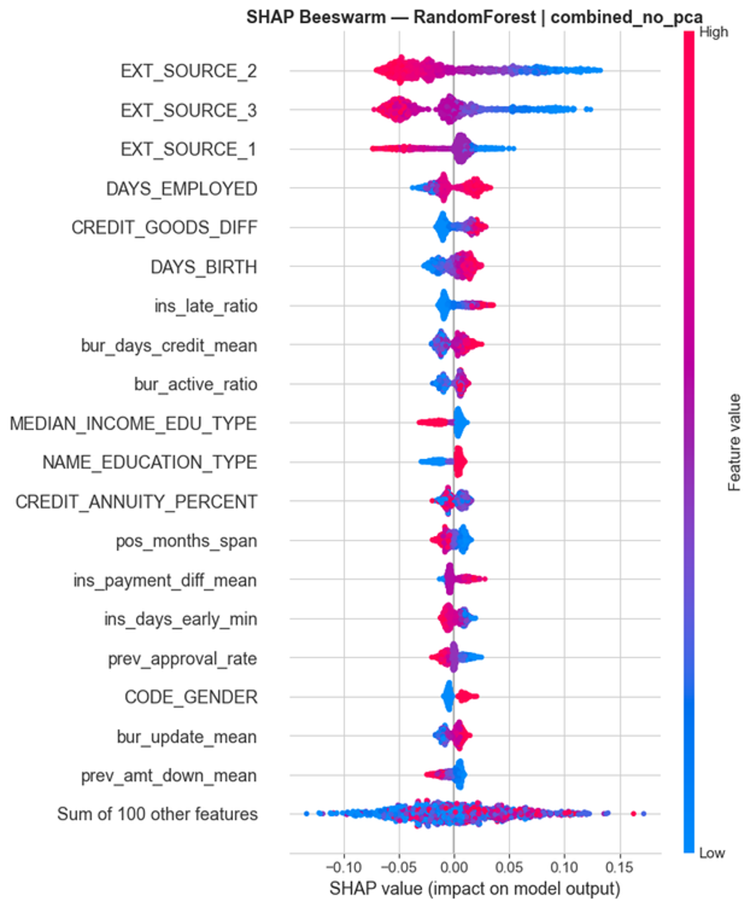
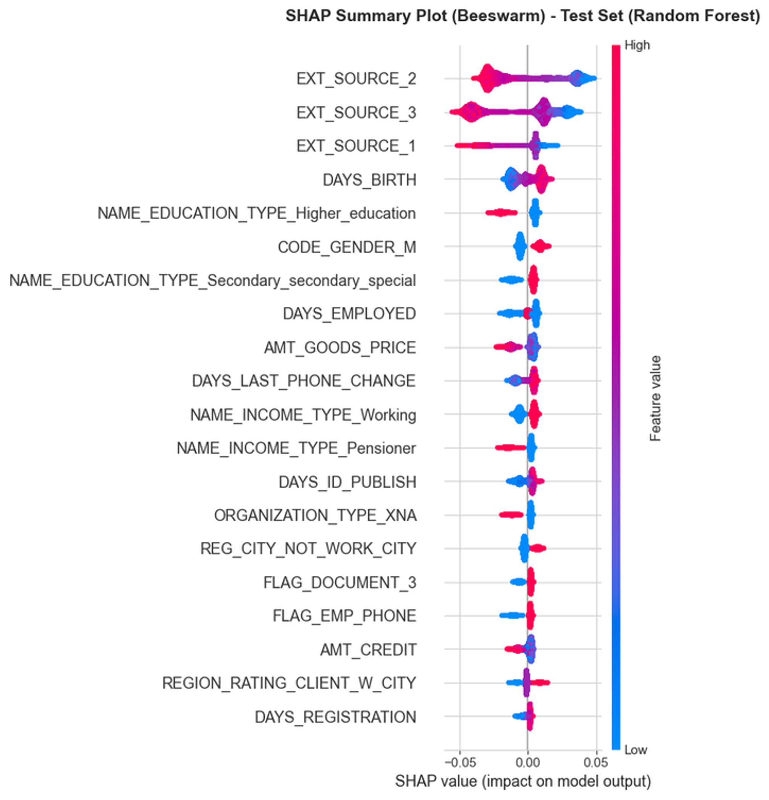

### TRADITIONAL

### COMBINED DATASET

Random Forest models are primarily driven by external scores. Other factors like age and education types also contribute to the prediction, but their overall impact on the model output is much smaller compared to the external score variables.

<!-- Slide number: 24 -->
# SHAP Explainability

## XGBoost
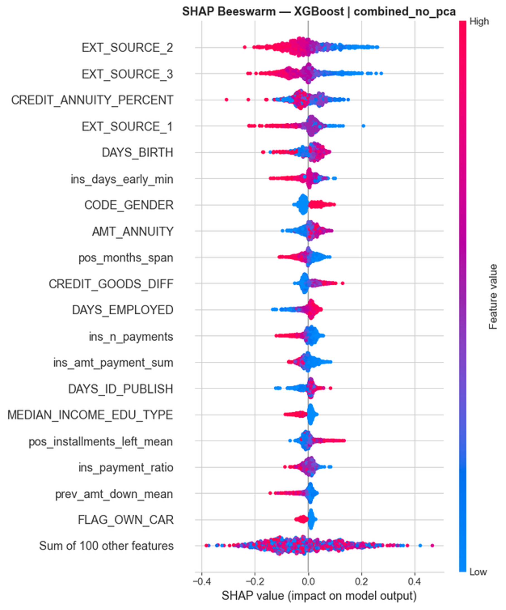
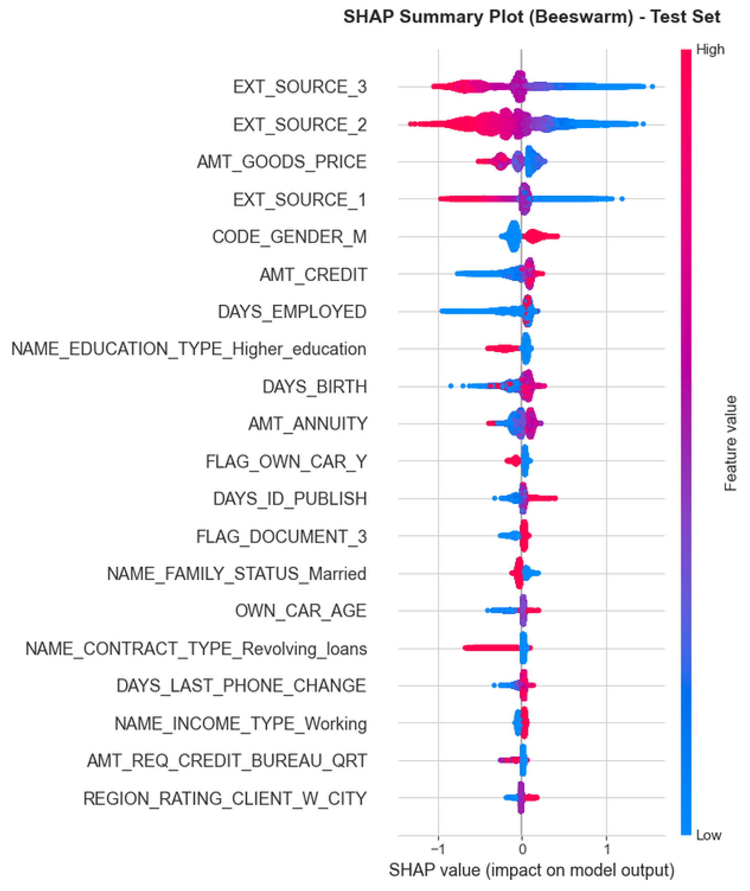

### TRADITIONAL

### COMBINED DATASET

The traditional model relies heavily on the external sources variables and AMT_GOODS_PRICE, whereas the combined model also incorporated a wider variety of engineered features like CREDIT_ANNUITY_PERCENT and installment history, which spread the predictive influence across more diverse financial behaviors.

<!-- Slide number: 25 -->

# SHAP Explainability

## LightGBM
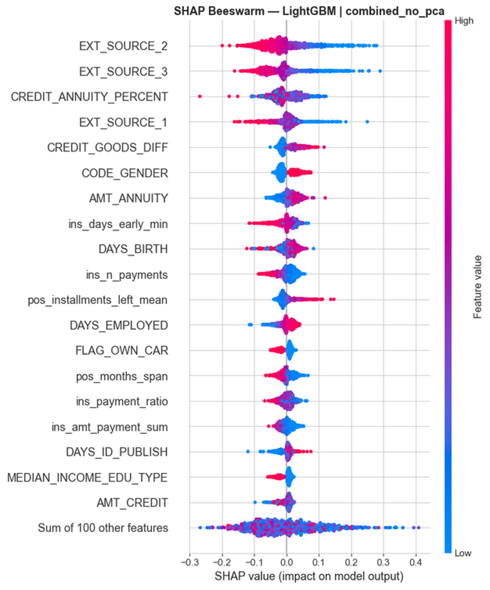
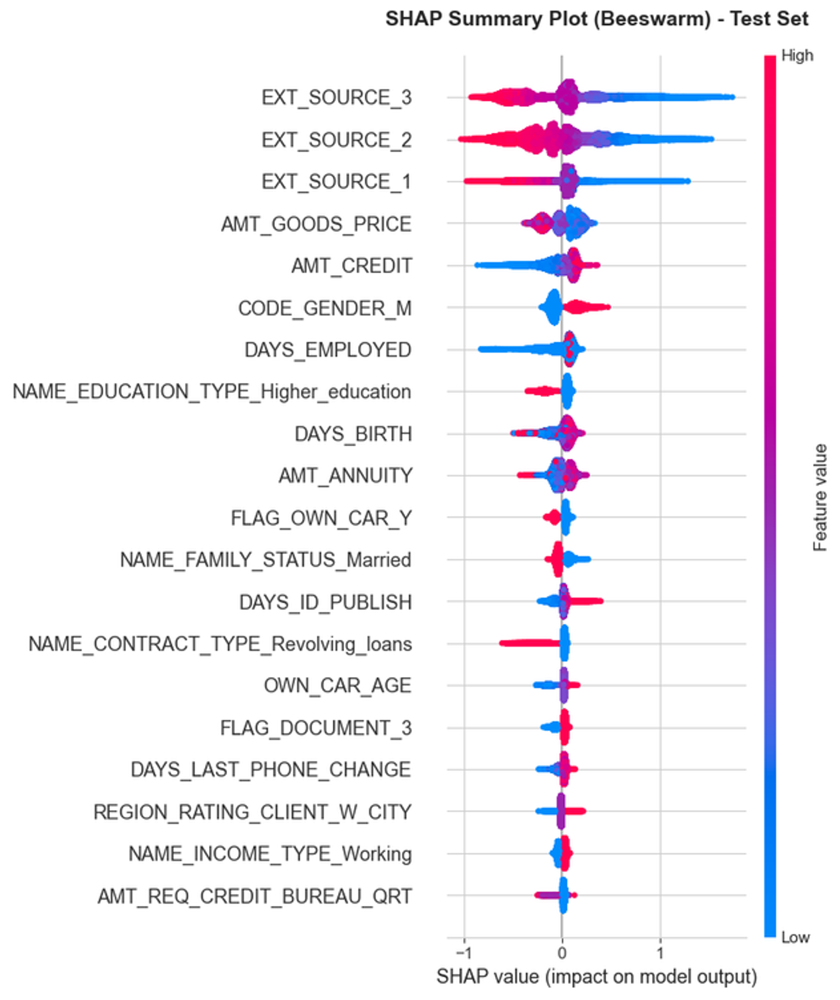
### TRADITIONAL

### COMBINED DATASET

Similar results to XGBoost since they both use gradient-boosting. However, the model trained on the combined dataset also leverages more of aggregated data from previous applications, installment payments history, etc.

<!-- Slide number: 26 -->

# PCA ANALYSIS
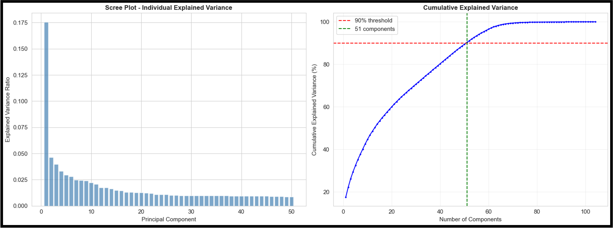
The scree plot shows that the first few principal components explain a large portion of the variance, with a sharp drop after the first component and a gradual decline thereafter. This indicates diminishing returns from adding more components. The cumulative variance plot shows that about 51 components are needed to capture 90% of the total variance.

<!-- Slide number: 27 -->

# FAIRNESS EVALUATION BY GENDER
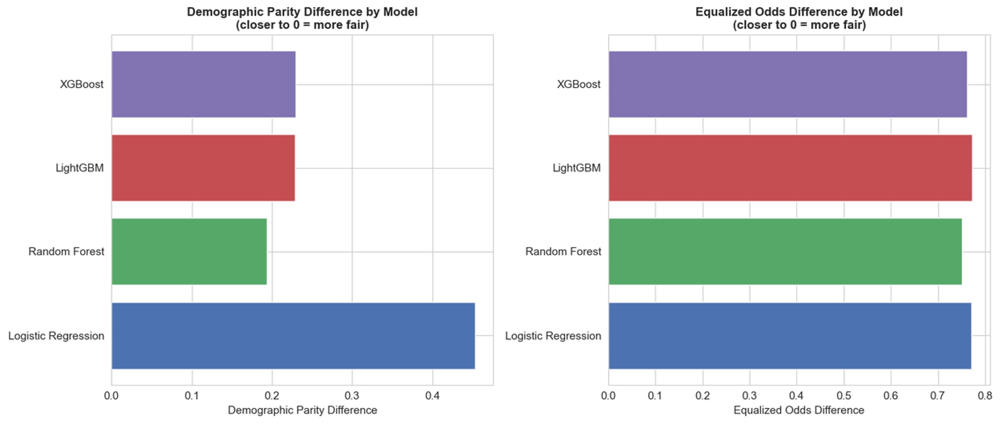

These metrics evaluate how fairly each model treats different genders, where values closer to 0 indicate less bias between groups.
Random Forest shows the lowest disparity, meaning it makes the most consistent predictions across genders.
XGBoost and LightGBM show moderate differences, indicating some level of gender bias in predictions.
Logistic Regression has the highest disparity, suggesting the strongest imbalance in outcomes between genders and the need for bias mitigation.

<!-- Slide number: 28 -->

# GENDER BIAS ANALYSIS
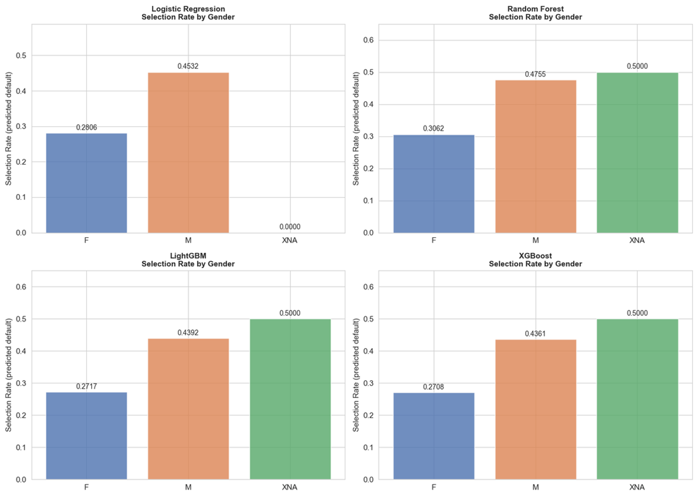

## RANDOM FOREST

More balanced compared to Logistic Regression, but still shows higher selection for males.
Provides consistent predictions across all groups, including XNA.

## LOGISTIC REGRESSION

Shows the largest gender disparity, with males having a much higher selection rate than females.
No predictions for XNA, indicating the model fails to generalize to this group.

## XGBoost

Slightly better balance than Logistic Regression but still biased toward males.
Handles XNA group well, showing consistent behavior like other ensemble models.

## LIGHTGBM

Similar trend with moderate disparity between males and females.
Maintains stable selection rates across all gender groups.

All models exhibit gender-based differences, with ensemble models being relatively more balanced than Logistic Regression.

<!-- Slide number: 29 -->

# CUSTOMER RISK SCORING - VALIDATION RESULTS
## Every loan applicant gets a score from 300 to 850 — the higher the score, the safer the customer
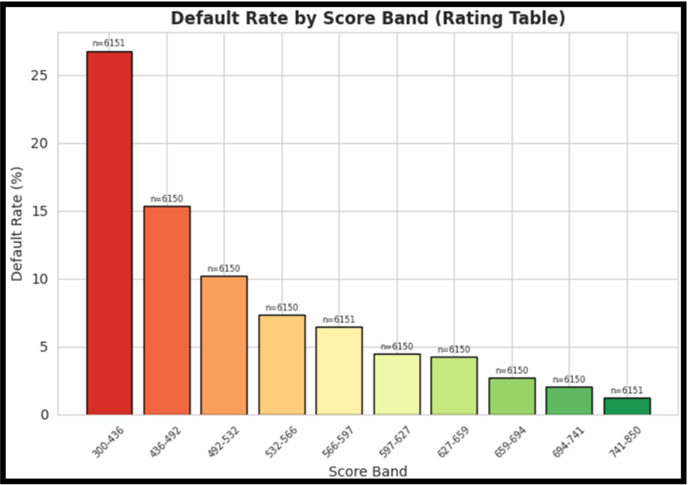

The scoring system is working - risky customers tend to score low and safe customers tend to score high. The separation between red and blue confirms the model has genuine predictive power.
## WHAT THE SCORE TELLS US?
Score = Offset + Factor × ln (odds)
industry standards, offset=600 ; Points to Double Odds = 20
| Score 741-850 | Very Safe to lend to |
| --- | --- |
| Score 627-741 | Low chance of default |
| Score 532-627 | Some caution needed |
| Score 436-532 | Higher risk |
| Score 300-436 | Very likely to default |

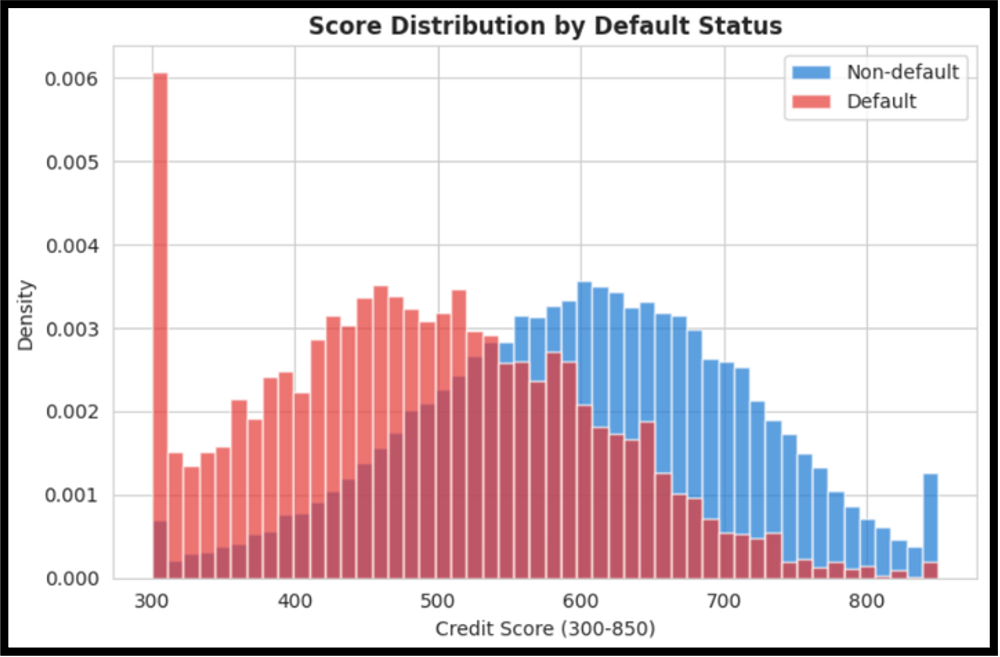
Customers in the lowest score band are 20× more likely to miss payments than those in the highest band. This confirms the score is a reliable and consistent tool for deciding who to lend to.

Every score below comes from the validation set - a separate group of customers the model had never seen during training. This is the true test of whether the scoring system works in the real world.

<!-- Slide number: 30 -->

# A-SCORE / B-SCORE / C-SCORE FRAMEWORK
## CREDIT RISK SCORING TIERS

| Score | When? | Data | AUC-ROC | Purpose | Top Features |
| --- | --- | --- | --- | --- | --- |
| A-Score | At application | Application + Bureau (external)- 170 features | 0.7156 | Approve/decline decision | EXT\_SOURCE\_2, EXT\_SOURCE\_1, EXT\_SOURCE\_3, NAME\_EDUCATION\_TYPE, DAYS\_BIRTH |
| B-Score | post-origination | POS/Installment/CC payment behavior (internal) - 34 features | 0.6159 | Portfolio monitoring, early warning | pos\_installments\_left\_mean, pos\_months\_total, ins\_late\_ratio, ins\_payment\_ratio, pos\_n\_active |
| C-Score | Delinquent accounts | DPD patterns, overdue amounts - 13 features | 0.5792 | Collection prioritization | ins\_late\_ratio, bur\_amt\_overdue\_sum, pos\_dpd\_mean, bur\_amt\_max\_overdue, pos\_dpd\_sum |

A-score performs the best with an AUC of around 0.72, driven mainly by external scores.
B-score and C-score have lower performance since behavioral and collection data are more noisy, but they are useful for monitoring and prioritization rather than initial prediction.

## trends in 2 major behavioural signals:

<!-- Slide number: 31 -->

# K-S SCORE METRICS
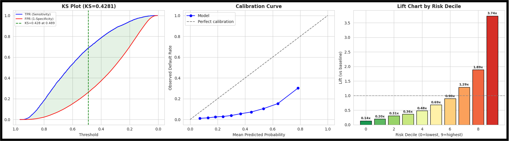

## KS
The model shows strong ranking power: the KS statistic is 0.428, which means it separates default and non-default cases fairly well. KS = 0.428 at 0.489 means that the maximum separation between defaulters and non-defaulters is 42.8%, and this happens at a prediction threshold of 0.489.

Interpretation:
KS measures how well the model separates good vs bad customers
General rule:
                                               < 0.2 → poor
                                       0.2–0.4 → average
                                        0.4–0.6 → good
                                               0.6 → excellent

## calibration
The calibration curve suggests the model is underpredicting risk overall, because observed default rates are consistently below the ideal diagonal line.

Interpretation:
Top 10% customers are ~3.7× more likely to default than average
                                           Model is:
Very effective for targeting risky customers
Useful for credit approval / rejection / pricing

## lift chart
The lift chart shows the highest-risk decile is much better than random, with about 3.74x lift, so the model is especially useful for prioritizing top-risk customers.

Interpretation:
Model is overestimating riskExample: predicts 0.6 → actual ≈ 0.15
 This means:
Good for ranking customers
But probabilities are not reliable directly

<!-- Slide number: 32 -->

# CONCLUSION
“To not miss the forest for the trees” - we have essentially proven that by incorporating alternative data (here: outside of application table) it is possible to expand the cornucopia of good, creditworthy borrowers even if they have no or minimal previous financial record, hence expanding business opportunity and value for all our stakeholders.

## QUANTITATIVE CONCLUSIONS:
Achieved project objectives with LightGBM models reaching AUC 0.76 using combined data from 8 tables.

External scores (EXTSOURCE1-3) as top predictors; behavioral data from 55M records improved performance 3.1% over application-only baselines.

Logistic regression based ABC scorecard (300-850 scale) provides interpretable risk segmentation, validated with clear defaulter/non-defaulter separation on unseen data.

## FURTHER INTERPRETATIONS
Ensemble models (LightGBM, XGBoost) performed the same as logistic regression on AUC and recall, minimizing misclassified defaults.

PCA retained 90% of the variance with 51 components, but slightly reducing performance due to dimensionality loss - because our choice of models are tree-based which is better at finding thresholds for individual features (unmixed & un-normalized).

Gender fairness analysis revealed moderate bias across models, with Random Forest showing the lowest disparity.

EXT-SOURCE-1 is a private credit bureau probabilistic scores because of the high NA count, and it increases with age, measurement of stability (how long one stayed in the same address and job)

EXT-SOURCE-2 is telco data usage - very few NA’s - even people with 0 payment history have this. We see defaulters with lesser, flat usage and non-defaulters with high data usage

EXT-SOURCE-3 is government or public numerical band credit score per our analysis - less varying values, aligns with DPD patterns, strongest negative correlation with defaulters.

We based the above in the data: 
EXT_SOURCE_1  56.4% missing
range 0.01 – 0.96
114K unique values
corr(TARGET) = −0.155
EXT_SOURCE_2  0.2% missing
range 0.0 – 0.85
119K unique values
corr(TARGET) = −0.161
EXT_SOURCE_3  19.8% missing
range 0.0005 – 0.90
814 unique values
corr(TARGET) = −0.179

<!-- Slide number: 33 -->

# HOW AI CAN HELP IN CREDIT SCORING ? -# OUR LEARNINGS
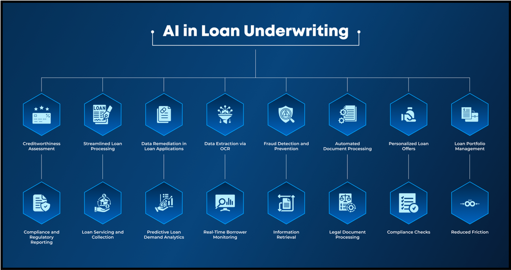
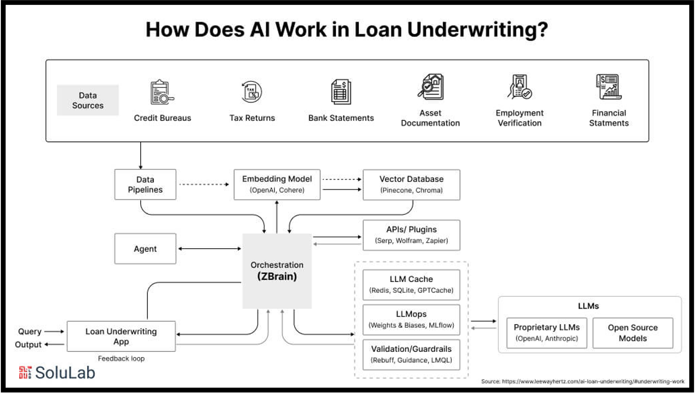

Faster loan processing by automating data collection and analysis
More accurate risk assessment using large datasets and AI models
Reduced operational costs by minimizing manual work
Personalized loan offers based on individual borrower profiles

<!-- Slide number: 34 -->

# RECOMMENDATION FOR STAKEHOLDERS

| Stakeholder | Priority Actions |
| --- | --- |
| Regulators & Governments - Home Credit & Risk Teams | - Deploy LightGBM production model with SHAP monitoring for real-time default prediction and feature drift detection. - Integrate ABC scorecard into loan approval workflow: auto-approve >741, manual review 532-741, reject <436. |
| Credit Bureau Companies - Product & Operations | - Prioritize external data enrichment (EXTSOURCE) for thin-file applicants to improve accuracy for unbanked segments. - Conduct quarterly fairness audits; apply reweighting to mitigate gender bias in high-risk decisions. |
| Banking & Financial Partners - Business Development | - Target males 20-25 (11% default rate) with education campaigns on responsible borrowing. - Scale behavioral aggregation pipeline to new markets, quantifying uplift from POS/installment data. |

<!-- Slide number: 35 -->

# LIMITATIONS

## DATA LIMITATIONS
Severe class imbalance (8% defaults, 111:1 ratio); future work: advanced sampling.
Supplementary tables sparse for some applicants (e.g., credit cards 28% coverage); impute via graph neural networks.
Traditional columns still outperform alternative ones for the highest contributing indicators of creditworthiness
Our current modelling has used readily available and related data for alternative analysis. However, this isn’t encompassing possible extra underlying patterns which could be extracted by exploring similar datasets and training unsupervised / foundation models on those to further use them for oure main modelling.

## MODEL & FAIRNESS CONCERNS
Assumed independence across tables.
Gender bias present.
Other proxy features are present, such as marriage status and car ownership status.

<!-- Slide number: 36 -->

# DATA GOVERNANCE
## HOW WOULD OUR ARCHITECTURE LOOK IN PRODUCTION

## Governance and Security:
Consent Framework: We will have opt-in data sharing with granular permissions per feature
Anonymisation: k-anonymity & differential privacy for spending data
Data Encryption: Prevent against cyber attacks
Point in Time Data: Implement PITR to hedge data loss
Data Residency: In-country storage per PDPA (TH), PDPA (SG), DPA (PH)
Right to Erasure: User can revoke data use; model retrained quarterly

## Data Partnerships
Our Stakeholders will be major source of live data

Create a Data Ecosystem with Custodians and
Financial Data providers like BBG/MSCI/Reuters Refinitiv

Use Compliance and reporting APIs with regulators

The pipeline would be Ingest → Process → Enrich → Run Model

## Risks and Mitigation:

Regulatory Non Compliance - Do periodic checks
Model Bias (Underrepresented user groups) - Do quarterly fairness audits, plan for undersampling/oversamplic as data changes dynamically
Data partner dependency / API outage - Have multiple sources
Stakeholder hesitation/mistrust & slow adoption - Transparent explainability dashboard; human advisor override option

<!-- Slide number: 37 -->

# FUTURE WORK

## OUR NEXT STEPS...

Test on out-of-time data for temporal validation.
Benchmark against production Home Credit models; aim for 2-5% default reduction via ABC scores.
Create more creative feature engineered variables, since the models considered many of our engineered variables important.
Scour more complementary alternative data to help bridge gaps in the current data.
Find more adjacent data for charting a richer picture of each individual.
Use open-source libraries and frameworks that can help us to check and eliminate biased features.

<!-- Slide number: 38 -->

# HELPFUL LINKS
OUR MAIN DATASET: https://www.kaggle.com/competitions/home-credit-default-risk/data 
some helpful analyses of our data: 
(1) https://www.kaggle.com/competitions/home-credit-default-risk/writeups/krak-w-lublin-i-zhabinka-overview-of-the-5th-solut
(2) https://www.kaggle.com/c/home-credit-default-risk/discussion/57175 
(3) pt1 https://medium.com/analytics-vidhya/home-credit-default-risk-part-1-business-understanding-data-cleaning-and-eda-1203913e979c
(4) https://medium.com/@dhruvnarayanan20/home-credit-default-risk-part-2-feature-engineering-and-modelling-i-be9385ad77fd
(5) pt3 https://medium.com/@dhruvnarayanan20/home-credit-default-risk-part-3-modelling-ii-and-model-deployment-3b3f92e1926c 
(6) git repo of above author: https://github.com/dhruv1394/Home-Credit-Default-Risk/tree/main

# READING LIST:
https://www.investopedia.com/personal-finance/top-three-credit-bureaus/
https://www.investopedia.com/terms/f/fico-fair-isaac.asp
https://www.kaggle.com/competitions/home-credit-default-risk/data ⇒ our main data

SOME REPOs we referred to:
https://github.com/rounak97/Credit-Risk-Modelling-Using-Machine-Learninghttps://github.com/shoumyac/bd-sme-research

SOME DATASETS we referred to:
https://www.kaggle.com/datasets/parisrohan/credit-score-classification
https://www.kaggle.com/datasets/ranadeep/credit-risk-dataset
https://www.listendata.com/2019/08/datasets-for-credit-risk-modeling.html
https://www.kaggle.com/datasets/adarshsng/lending-club-loan-data-csv

SOME COMPANIES we referred to (for possible collaboration):
https://docs.google.com/spreadsheets/d/18s1o84u73IjCnyC45NcJ3uAhbE-GjucmTqzZlS_d-qk/edit?gid=0#gid=0

<!-- Slide number: 39 -->

# THANK YOU

 -SOVEREIGN PRISM 🌈⃤ —

# PROFESSORS'S FEEDBACK ON THE PRESENTATOIN WHICH WE NEED TO INCORPORATE INTO OUR REPORT 
1. Business objective was the business goal slide
2. Whatever is there in business objectives and technical objectives is just technical objectives
3. ⁠how as alternative data helped or not helped mention clearly
4. ⁠credit scoring is the dataset disjoint
5. ⁠why decision tree was not used - sholdve used as another baseline model in additoin to logistic regression

