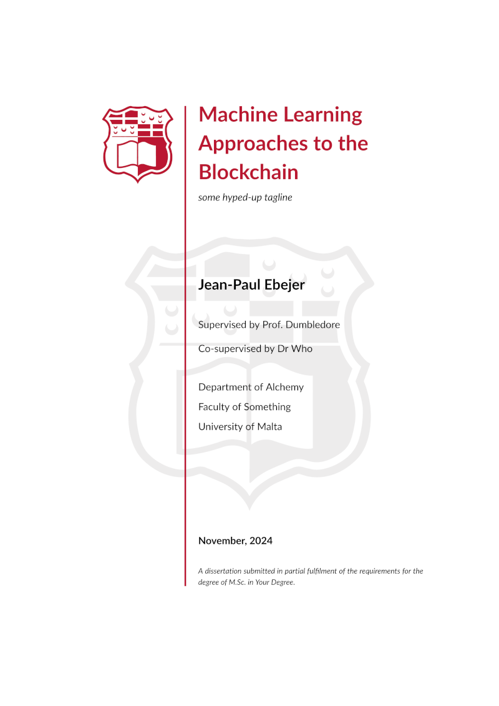
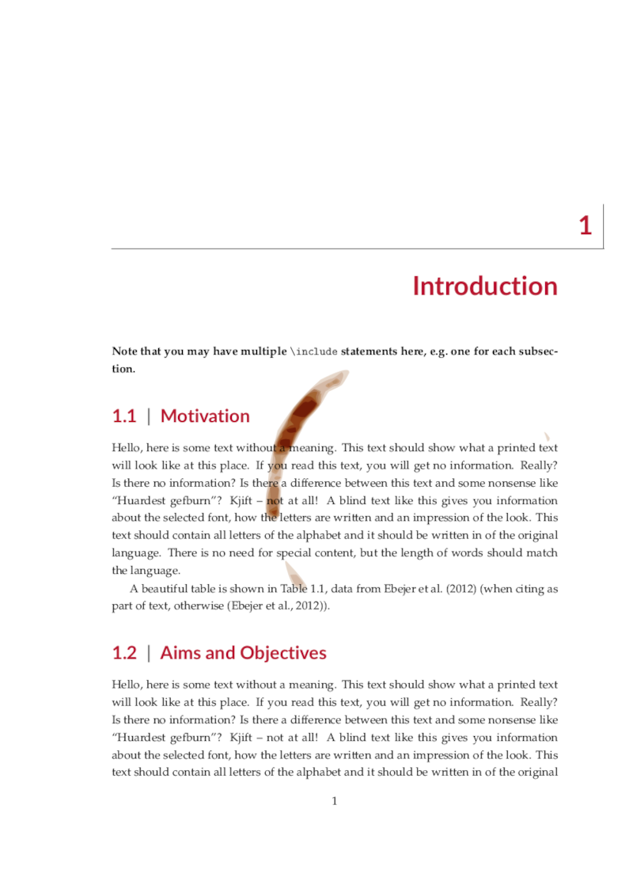
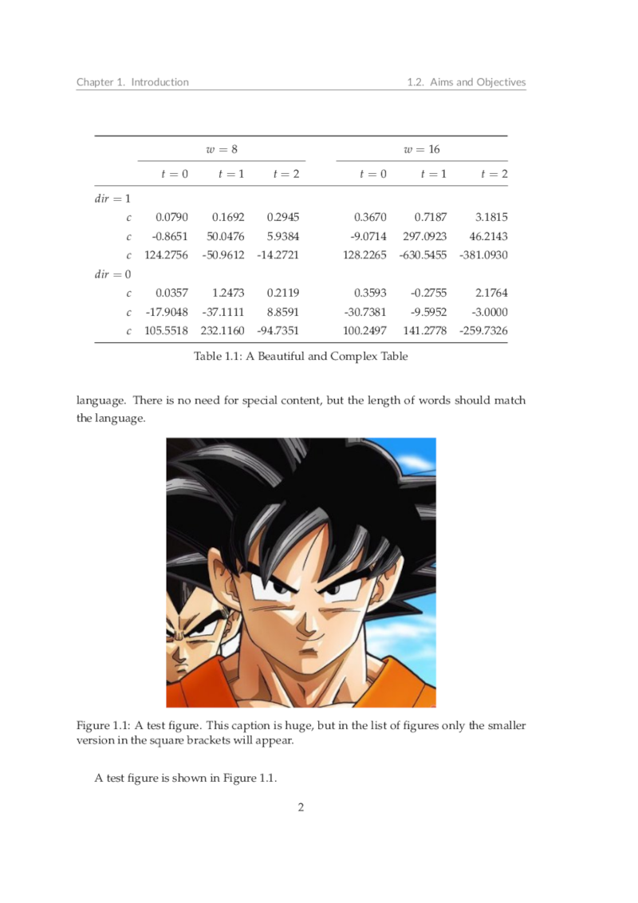
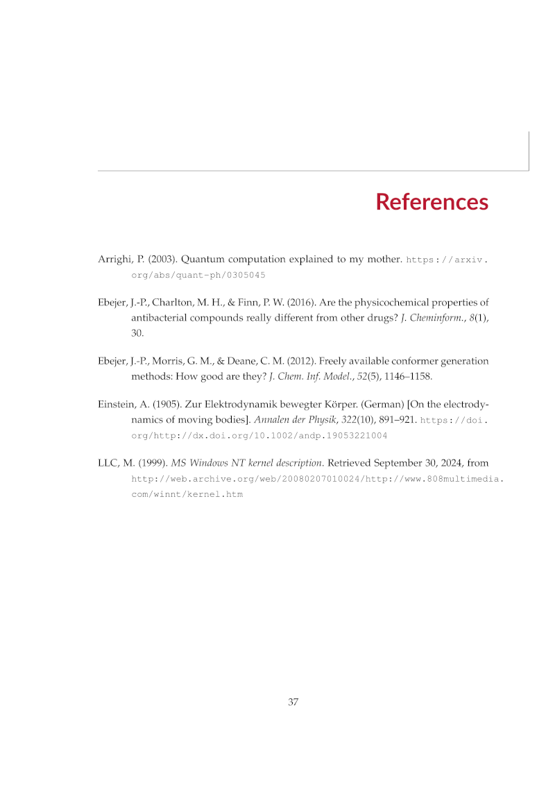
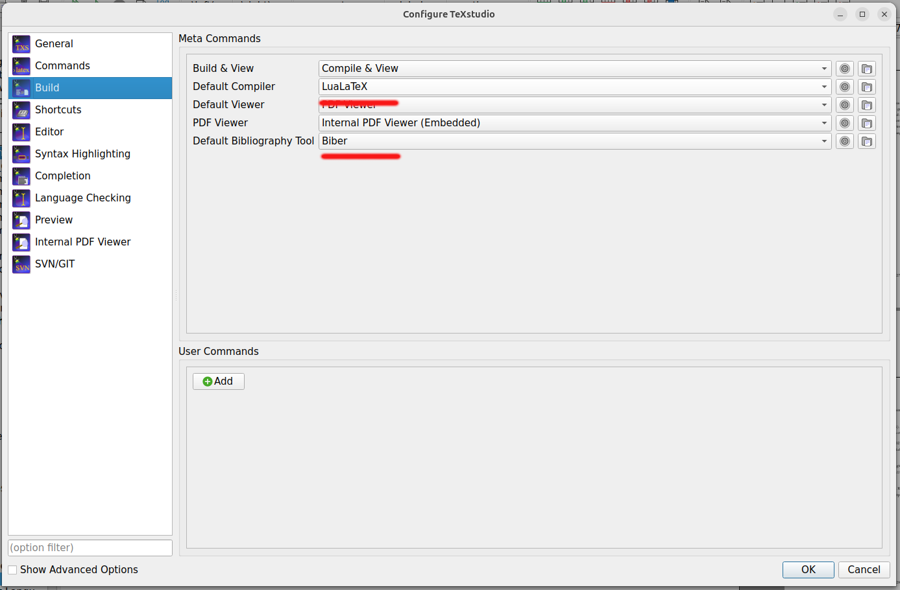
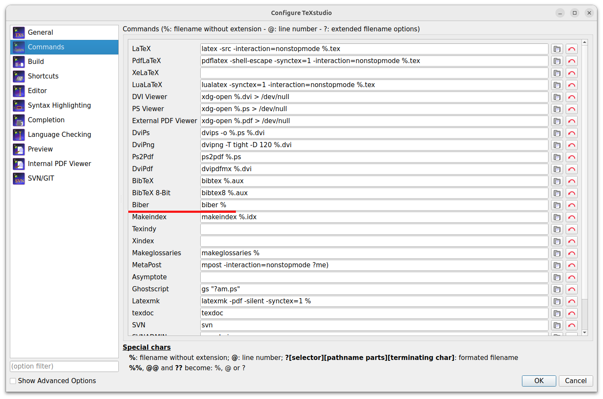

# Preamble

Before embarking on this journey, I suggest you read my [LaTeX](https://bitsilla.com/blog/2019/01/latex-tips-for-your-dissertation-or-project-write-up/) and [content](https://bitsilla.com/blog/2019/03/content-tips-for-your-dissertation-or-project-write-up/) tips.

# National University of Singapore &ndash; LaTeX Dissertation (or Thesis) Template

Let us not waste any time, you have a project to write up!  [Here](https://github.com/jp-um/university_of_malta_LaTeX_dissertation_template/blob/master/dissertation_main.pdf) is a complete example (PDF format) of what this LaTeX template looks like.  Or quicker...




Now back to the boring bits ...

A modern, highly configurable assignment/project/fyp/dissertation/thesis template for the National University of Singapore.  (In reality, there is nothing specific to the National University of Singapore, and this LaTeX class may be used anywhere).  This template is loosely based on my D.Phil. Thesis at the University of Oxford, which was loosely based on ...  You get the drift.

This template was clearly needed, as I keep correcting/examining poorly and inconsistently formatted dissertations all the time.  Updates to the template with examples (2-page landscape table anyone?) are greatly appreciated -- either through pull requests, github issues or emails (jean.p.ebejer@um.edu.mt).

The main file is `dissertation_main.tex`, and this will show you how to organise your dissertation.  Basically replace all `\blindtext` commands with your content and you are there, ready to print.  This is obviously a case of something more easily said than done.

I am also keen on keeping an FAQ with the most common LaTeX problems, which you are bound to face on the night before your submission deadline.

# Sovereign Prism Quick Onboarding

This dissertation has already been customised beyond the base template.  The notes below are the fastest way to re-onboard yourself the next time you need to make small layout or content edits.

## Core Files

- `dissertation_main.tex`: main entrypoint, shared macros, bibliography setup, chapter order, appendix order
- `chap1/` to `chap8/`: main chapters
- `appA/` to `appD/`: appendices
- `frontmatter/abbreviations.tex`: acronym definitions
- `references.bib`: bibliography database
- `images/`: shared image pool, with subfolders such as `pptx/`, `notebook/`, `discussion/`, and `venky/`

## Compile the PDF

Recommended build from inside `SovereignPrism_IFRM_dissertation/`:

```bash
latexmk -lualatex -use-biber dissertation_main.tex
```

Manual build sequence:

```bash
lualatex dissertation_main.tex
biber dissertation_main
lualatex dissertation_main.tex
lualatex dissertation_main.tex
```

Clean aux files:

```bash
latexmk -c
```

If TeX cache permissions ever behave oddly on a restricted environment, this fallback is useful:

```bash
TEXMFVAR=/tmp/texmf-var latexmk -lualatex -use-biber dissertation_main.tex
```

Important:

- Use `lualatex`, not `pdflatex`
- Bibliography uses `biblatex` with `biber`
- If references do not appear, the `biber dissertation_main` step was probably skipped

## Figure Macros and Image Control

Most figures should use the shared macros in `dissertation_main.tex`.

Single figure with border:

```tex
\ProjectFigure[!htbp][width=0.85\textwidth]
  {images/example.png}
  {Short LoF Title}
  {Long caption shown under the figure.}
  {fig:example}
```

Single figure without border:

```tex
\ProjectFigure*[!htbp][width=0.85\textwidth]
  {images/example.png}
  {Short LoF Title}
  {Long caption shown under the figure.}
  {fig:example}
```

Two-up figure:

```tex
\ProjectTwoFigure[!htbp][width=0.49\textwidth][width=0.41\textwidth]
  {images/left.png}
  {images/right.png}
  {Short LoF Title}
  {Long caption for both images.}
  {fig:two_up}
```

Rules to remember:

- `\ProjectFigure` = bordered
- `\ProjectFigure*` = no border
- `\ProjectTwoFigure` = bordered two-up
- `\ProjectTwoFigure*` = no-border two-up
- The short caption argument is what appears in the List of Figures
- The long caption argument is what appears below the image

Global figure controls currently live in `dissertation_main.tex`:

- `\SPGlobalImageScale`: scales most shared figures globally
- `\SPFigureHeight`: max figure height used by the shared macros
- `\SPFigureFrameSep`: padding between image and border

### How to Resize Images

- For one figure, change `width=0.85\textwidth` to something like `0.80\textwidth` or `0.90\textwidth`
- For two-up figures, the first width controls the left image and the second width controls the right image
- For a global nudge across most figures, change:

```tex
\newcommand{\SPGlobalImageScale}{0.9}
```

- Good resizing habit: change widths in steps of about `0.02\textwidth`

### How to Reorder Images

- Move the entire figure block up or down in the chapter `.tex` file
- If a figure drifts too far away from the surrounding text, add `\FloatBarrier` after the local figure group
- Use `[H]` if you need a figure to stay tightly in place
- Use `[!htbp]` if you want LaTeX to place it more flexibly

### Placeholder Images

If you want a file reference to stay in the document even before the actual image exists, use:

```tex
\ProjectOptionalGraphic[width=0.9\linewidth]{images/finalGantt.png}{Final Gantt chart placeholder}
```

This will render the real image if it exists, or a placeholder box if it does not.

## Tables, Wrapped Code Text, and Borders

The dissertation currently auto-frames every `tabular` environment, so standard tables already get an outer border.

Useful helpers:

- `L{3cm}`: wrapped ragged-right column of fixed width
- `\CodeCell{...}`: wrapped monospaced content for long filenames, variables, formulas, and code-like text
- `\CorrCell{...}`: shaded correlation-matrix cell helper

Example:

```tex
\begin{tabular}{L{3cm}L{6cm}L{5cm}}
\toprule
\textbf{Feature} & \textbf{Formula} & \textbf{Meaning} \\
\midrule
\CodeCell{cc_avg_utilization} &
\CodeCell{mean(AMT_BALANCE / AMT_CREDIT_LIMIT_ACTUAL)} &
Average usage relative to the card limit \\
\bottomrule
\end{tabular}
```

Practical advice:

- Avoid raw `\texttt{...}` inside narrow table columns if the string is long
- Prefer `\CodeCell{...}` for code-style text that must wrap
- Prefer `L{...}` columns over plain `l` columns when text is long
- Use `longtable` if a table must span pages

## Citations and Bibliography

Bibliography is loaded from:

```tex
\addbibresource{references.bib}
```

Typical workflow:

1. Add a new entry to `references.bib`
2. Cite it in the text with `\cite{bibkey}`
3. Rebuild with `biber`

Examples:

```tex
Credit scoring remains central to retail underwriting~\cite{siddiqi2012}.
```

For plain URLs that are not formal references, use:

```tex
\url{https://example.com}
```

## Abbreviations and Acronyms

Abbreviations live in `frontmatter/abbreviations.tex`.

Add a new acronym like this:

```tex
\acro{AIF360}{AI Fairness 360}
```

Then use it in the main text like this:

- `\ac{AIF360}`: first use expands, later uses shorten
- `\acs{AIF360}`: short form only
- `\acf{AIF360}`: full form only

Only acronyms actually used in the text appear in the printed abbreviation list.

## Adding Chapters, Sections, and Appendices

Inside a chapter file, use the normal structure:

```tex
\section{Section Title}
\subsection{Subsection Title}
\subsubsection{Subsubsection Title}
```

To add a new chapter:

1. Create a new file such as `chap9/new_chapter.tex`
2. Add `\input{chap9/new_chapter}` under `\mainmatter` in `dissertation_main.tex`

To add a new appendix:

1. Create a new file such as `appE/appendix_e_main.tex`
2. Add `\input{appE/appendix_e_main}` after `\appendix` in `dissertation_main.tex`

The document flow is:

- `\frontmatter`: title page, acknowledgements, abstract, contents, lists, abbreviations
- `\mainmatter`: main dissertation chapters
- `\appendix`: appendix material

## Page Breaks and Float Control

Useful commands:

- `\newpage`: start a new page
- `\clearpage`: start a new page and flush pending floats first
- `\cleardoublepage`: like `\clearpage`, but for two-sided layouts
- `\FloatBarrier`: prevent figures/tables from floating past this point

Common use cases:

- Use `\clearpage` before a major transition if you want all figures/tables to appear before moving on
- Use `\FloatBarrier` at the end of a dense subsection to stop figure drift across sections
- Use `[H]` sparingly when exact locality matters more than page efficiency

## Hyperlinks, Captions, and Labels

- Hyperlinks are styled in `dissertation_main.tex` via `\hypersetup{...}`
- Figure captions are bold by design
- Cross-references depend on `\label{...}` and `\ref{...}`

Good habit:

```tex
\section{Model Validation}
\label{sec:model_validation}
...
See Figure~\ref{fig:ks_cal_lift} for the combined diagnostic view.
```

## Image Paths

`dissertation_main.tex` already declares a shared `\graphicspath`, so most figures can be referenced with short relative paths such as:

- `pptx/model architecture.png`
- `notebook/home_credit_modeling_combined_ks_plot_15.png`
- `discussion/Credit_Card_Balance_correlation_matrix_key.png`

## Fast “What Should I Change?” Guide

- Want a border added? Change `\ProjectFigure*` to `\ProjectFigure`
- Want a border removed? Change `\ProjectFigure` to `\ProjectFigure*`
- Want a figure slightly smaller? Reduce the `width=...`
- Want a figure moved? Move the whole figure block in the `.tex` file
- Want a figure to stop drifting? Add `\FloatBarrier` or switch to `[H]`
- Want a code-like table cell to wrap? Use `\CodeCell{...}`
- Want a new reference? Add it to `references.bib` and cite with `\cite{...}`
- Want a new acronym? Add it to `frontmatter/abbreviations.tex` and use `\ac{...}`

# Requirements

To build this template you will need `latexmk`, `lualatex` (a modern LaTeX engine), `biber` as a `bibtex` replacement, the beautiful Lato font for headings, and also algorithm typesetting from the science packages.  The Lato sans font using in headings creates a pleasing contrast with the serif text. If you require Maltese, you will also need TeX Live 2024 (or later).

# How to build

To build this template into a dissertation you can either use a GUI (like TexStudio) or the command line.  

## Command Line Build

In the directory where `dissertation_main.tex` resides:

```
latexmk -lualatex
```

This generates a lot of clutter, but it is important to go through it as some warnings can give you valuable insight on stuff to fix for a perfect presentation. To clean all the LaTeX generated files:

```
latexmk -c
```

Note that this will leave the generated `pdf` file, as is desirable most of the cases.

## Using TexStudio

To build using TexStudio (F5) you will need to set some options to use biber instead of BibTeX. Under `Options -> Configure TeXstudio` select `Build` and set the `Default Bibliography Tool` to `Biber` from the drop-down list as highlighted in red below.

<p align="center">

</p>

Additionally, under `Options -> Configure TeXstudio` select `Commands` and set the `Biber` text field to `biber %` (highlighted in red below).

<p align="center">

</p>

You should now be able to load the main TEX file (i.e.\ `dissertation_main.tex`) and select `Tools -> Build & View` (or press the F5 shortcut).  Voilà (but do get in touch via the Issues page or email if you cannot sort this out).


# FAQ

The following are a few questions which have been asked about this template (sometime multiple times).


## Why do you make use of LuaLaTeX (instead of pdfLaTeX)?

* You want multilingual documents (Arabic, Chinese, Maltese, etc.).
* You need to use system fonts easily.
* You want future-proof, modern LaTeX with scripting potential.
* You care about high-quality typography.

This template will not work with pdfLaTeX.

## What is the difference (if any) between a thesis and a dissertation?

> National University of Singapore regulations specify a thesis only in case of PhD, and SThD degrees.  In all other cases it is a dissertation.

Bet you didn't know this one bit of academic trivia!  (Note: The answer is specific to the National University of Singapore, answer given by our dear registrar, Ms Veronica Grech).


## Which referencing style does this template use?

The template uses the APA referencing style, although it is pretty easy to change to IEEE or Harvard (or anything else for the matter).  The template uses the BibLaTeX package.


## For references, which is better (42) or (Ebejer et al., 2024)?

Many computational scientists are used to the IEEE referencing style with numbers, i.e. `(42)`.  But there is a reason why author year citations, or similar, are superior.  Your examiners (and supervisors) will be well acquainted with the research area and will know which are the main papers you should have read (and cited).  If you use numbered referencing, the examiner has to keep cross-referencing the *References* section.  This is not the case when using the name of the author and year directly in the citation.  Moreover, it is easier for the examiner to realize when you are mis-citing an author.  Modern typesetting is moving in this direction.


## How do I set the document for double-sided printing?

By default the template uses one-sided printing settings as most submissions are electronic nowadays. If you want to change that, simply pass `twoside` as an option to the document class (as opposed to `oneside`) in `dissertation_main.tex`.


## How do I make continuous footnote numbers?

The default in books is for footnote numbers to restart at each chapter (like figures or equations). If you do not want this behaviour, and require continuous numbering for your footnotes add `\counterwithout{footnote}{chapter}` to the preamble in `dissertation_main.tex`.


## May I use this template for my assignment?  What changes do I need?

You must, not should!  You should view any written submission as a training opportunity for your final dissertation.  Getting familiar with the template will help you out later in the course.  Of course, some (very) minor changes to the template are required; as follows:

- From `dissertation_main.tex` comment out (`%`) frontmatter sections for originality, dedication, acknowledgements, and abstract (these would look silly in an assignment).  
- Also, from the same file `dissertation_main.tex` comment out all the appendix material (unless you actually have an appendix; unlikely)

(Let me know if any more changes are required)


## Why are there so many blank pages?

Blank pages are only generated with the `twoside` option.  This is because typesetters don't start new chapters (and abstracts/acknowledgements/etc.) on the *verso* side (left in the western-world) when using both sides of the paper.  Chapters start on the *recto* side (right), so an empty page is inserted if the chapter start falls on the *verso* side (left).  The `oneside` option clearly has no empty pages (or has blank pages at the back of each paper, so every *verso* page is empty).  Note that the page margins are different for the *recto* and *verso* sides in the `twoside` option, this is because of the spline (which is on the right for *verso* and left for *recto*). I hope this is clear, I am an amateur typesetter.


## My supervisor(s) says section X should be named Y.  What should I do?

It is always counter-productive to **not** listen to your supervisor.  This is a generic template, and your specific use-case may have different requirements.  For example, in some departments it is common to have a "Methodology" section instead of the (more experimental) "Materials & Methods".  Elsewhere, the "Evaluation" section is sometimes merged in the "Results and Discussion" chapter.  Some faculties require a standard cover page.  This template is very flexible, and any changes are easy/trivial to make.  The important thing is to use good judgement and that **you follow your supervisor's advice**.


## How do I change the one-and-a-half to double line spacing?

In my opinion you don't want to do this because the document is going to become very long. The idea of having double line spacing is to let examiners/supervisors write between the lines. This is not required for the final submission and mostly superceded by more modern word-processing and reviewing tools. Also, the current one and a half line spacing gives enough space for this.

If you want to go ahead anyway with this, change this line in [um.cls](https://github.com/jp-um/university_of_malta_LaTeX_dissertation_template/blob/aa35454ad53fc4114d7798c8f3b442f59bc9cabb/um.cls#L123) from `\OnehalfSpacing` to `\DoubleSpacing`.

## How do I change the document margins?

Also required in ancient times to write notes in the margin (and again superceded by modern word-processing and reviewing tools).

Still, should be an easy one, just change the values in the following line in [um.cls](https://github.com/jp-um/university_of_malta_LaTeX_dissertation_template/blob/aa35454ad53fc4114d7798c8f3b442f59bc9cabb/um.cls#L148).

## How do I write good Latex Mathematical Notation/Formulae?

The [Math on Quora](https://math-on-quora.surge.sh/) is all you need. Any math notation you might need is available conveniently in the menu bar. All examples contain live code blocks so you can try out your math formulae directly in the web browser.

## How do subgroup my chapters in parts?

Some of the longer documents, such as doctoral dissertations, require a sub-grouping of chapters together. This may be easily achieved with `\part{My First Part}` in the the main document file (e.g. `dissertation_main.tex`) right before the chapters which make up the part (see [example](https://github.com/jp-um/university_of_malta_LaTeX_dissertation_template/blob/main/dissertation_main.tex)).


## I have a huge figure which takes up all the page.  I would like to switch off headers and the bottom page numbers, but `\thispagestyle{empty}` does nothing (or changes some other page).

The template uses the `floatpag` package.  All you need to do is place a `\thisfloatpagestyle{empty}` inside the figure or table environment.  Et voilà!  There is an example of this [here](https://github.com/jp-um/university_of_malta_LaTeX_dissertation_template/blob/aa35454ad53fc4114d7798c8f3b442f59bc9cabb/chap3/materials_and_methods_main.tex#L415).
